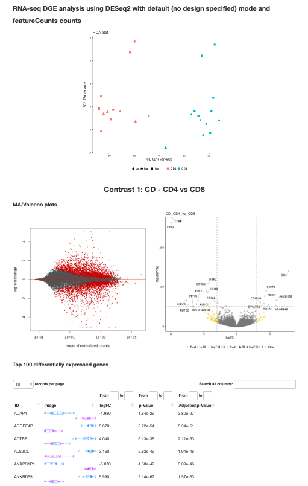
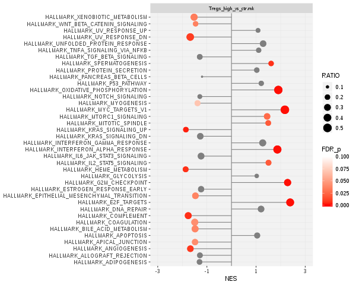

# DGE: Output

This document describes the output produced by the pipeline.

## Pipeline overview
The pipeline is built using [Nextflow](https://www.nextflow.io/)
and processes data using the following steps:

* [deseq2](#deseq2) - Performs differential gene expression analysis
* [gsea](#gsea) - Runs GSEA on the results from DESeq2

## deseq2

The [DESeq2](https://bioconductor.org/packages/release/bioc/html/DESeq2.html) package is used for differential gene expression analysis.
The pipeline produces text files and plots with the results, as well as an HTML report that contains a summary of the DGE results, This report shows a PCA plot on top, and then, 
for each comparison (contrast), shows MA and volcano plots, a heatmap, as well 
as a table with the names, logFCs, pvlaues and boxplots for the top-100 differentially expressed genes. For example:

## gsea

[GSEA](http://software.broadinstitute.org/gsea/index.jsp) is used to look for enrichment of gene sets at the top or bottom of the rnaked list of genes obtained from the DGE analysis. The [hallmark gene 
sets](http://software.broadinstitute.org/gsea/msigdb/collections.jsp) from MSigDB is used by default.
For each comparison, the pipeline produces a folder with the typical results obtained from running GSEA, as well as a plot that summarizes the results:

